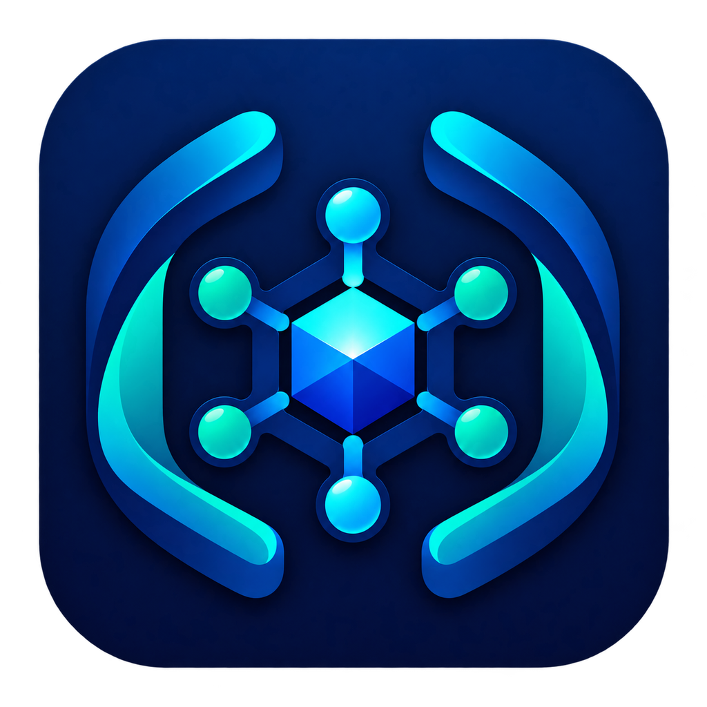

<p align="center">
  
</p>

<h1 align="center">DeepSeek Harness Desktop</h1>

<p align="center">
  将 DeepSeek Harness Web UI 封装为安全、原生、跨平台的桌面应用。
</p>

<p align="center">
  <a href="https://github.com/WD-CHINA/deepseek-harness-desktop/actions/workflows/ci.yml"></a>
  <a href="https://github.com/WD-CHINA/deepseek-harness-desktop/actions/workflows/pages.yml"></a>
  <a href="https://github.com/WD-CHINA/deepseek-harness-desktop/releases"></a>
  
  
</p>

<p align="center">
  <a href="https://wd-china.github.io/deepseek-harness-desktop/">项目官网</a> ·
  <a href="https://github.com/WD-CHINA/deepseek-harness-desktop/releases">下载版本</a> ·
  <a href="docs/RELEASING.md">发布指南</a>
</p>


## 项目简介

DeepSeek Harness Desktop 是 [deepseek-ai/deepseek-harness](https://github.com/deepseek-ai/deepseek-harness) 的 Electron 桌面宿主。Electron 主进程使用自身携带的 Node.js 运行时启动 `dsh web`，从输出中取得系统分配的回环端口，再将本地 Web UI 加载到隔离的 `BrowserWindow` 中。

当前应用信息：

- 应用 ID：`com.harness.deepseek-harness-desktop`
- 产品名称：`DeepSeek Harness Desktop`
- 当前版本：`0.0.1`
- Harness 依赖：`@deepseek-ai/dsh@0.1.0-rc.6`，精确锁定
- 作者：Bill（仓库不公开作者邮箱）

## 核心能力

- 支持 macOS Apple Silicon、macOS Intel 和 Windows x64 原生构建。
- Harness 服务仅监听 `127.0.0.1` 的系统随机端口。
- 开启 `contextIsolation`、沙箱和 Web 安全，关闭渲染进程 Node.js 集成。
- 主窗口只允许 Harness 同源导航；HTTP(S) 外链交给系统浏览器。
- 单实例运行，并处理窗口重建、后台服务异常退出和渲染进程崩溃。
- 应用退出时清理完整子进程树：Unix 使用进程组信号，Windows 使用 `taskkill /T`。
- Harness 配置、会话和凭据存放在 Electron `userData/dsh`，不写入默认 `~/.dsh`。

## 架构

```text
Electron Main
  ├─ 创建隔离 BrowserWindow
  ├─ 启动 Electron 内置 Node.js
  │    └─ @deepseek-ai/dsh → dsh web --port 0
  ├─ 解析 http://127.0.0.1:<port>
  └─ 关闭应用时终止 Harness 进程树
```

桌面壳不复制或修改 Harness 前端。升级 Harness 时，通过精确版本、锁文件、自动化测试和跨平台打包检查控制兼容性风险。

## 本地开发

环境要求：

- Node.js 22
- npm（使用仓库中的 `package-lock.json`）
- macOS 或 Windows；Linux 仅保留 electron-builder 配置，不在当前 CI 支持矩阵内

```bash
git clone git@github.com:WD-CHINA/deepseek-harness-desktop.git
cd deepseek-harness-desktop
npm ci
npm start
```

默认工作区为当前用户的 Documents 目录。可通过命令行或环境变量指定初始工作区：

```bash
npm start -- --workspace /absolute/path/to/workspace

# 或
DSH_WORKSPACE=/absolute/path/to/workspace npm start
```

Harness Web UI 首次使用时仍需添加并选中工作区，然后才能发送任务。

## 常用命令

| 命令 | 用途 |
| --- | --- |
| `npm start` | 编译并启动开发版 Electron 应用 |
| `npm run typecheck` | TypeScript 类型检查 |
| `npm test` | 执行 Vitest 测试 |
| `npm run verify` | 类型检查、测试和构建 |
| `npm run pack` | 生成当前平台未压缩应用目录 |
| `npm run pack:mac` | 生成 macOS 安装产物 |
| `npm run pack:win` | 生成 Windows 安装产物 |
| `npm run pages:build` | 将 GitHub Pages 官网构建到 `_site/` |

由于 Harness 运行依赖体积较大，桌面打包和逐文件签名会明显慢于普通 Electron 壳。当前 `asar` 暂时关闭，待 macOS 与 Windows 都验证明确的 unpack 规则后再启用。

## 构建与发布

CI 在原生 GitHub-hosted runner 上执行：

- macOS arm64：`macos-15`
- macOS x64：`macos-15-intel`
- Windows x64：`windows-latest`

Pull Request 和 `main` 分支推送会运行质量检查、未签名打包验证及 Windows 生命周期冒烟测试。推送与 `package.json` 版本一致的 `v*` 标签后，Release 工作流才会尝试签名、公证并创建 GitHub Release。

证书不能由仓库安全地“自动生成”。发布者必须提供 Apple Developer ID、App Store Connect API Key 和 Windows Authenticode 证书。完整 Secrets 清单和发布步骤见 [docs/RELEASING.md](docs/RELEASING.md)。

## GitHub Pages

官网源码位于 `site/`，由 `.github/workflows/pages.yml` 构建并发布。首次部署前，在仓库 **Settings → Pages → Build and deployment → Source** 选择 **GitHub Actions**，随后推送 `main` 即可触发发布。

本地预览：

```bash
npm run pages:build
python3 -m http.server 4173 --directory _site
```

访问 `http://127.0.0.1:4173/`。

## 升级 `@deepseek-ai/dsh`

不要直接使用范围版本。升级时执行：

```bash
npm install --save-exact @deepseek-ai/dsh@<目标版本>
npm run verify
npm run pack
```

随后至少人工验证启动探活输出、工作区选择、任务创建、设置与会话持久化、外链打开、应用退出后的进程残留，并等待三个原生平台打包任务全部通过。若 DSH 的 CLI 路径、`dsh web` 参数或 ready-line 输出变化，需要同步调整 `src/harness-runtime.ts` 与解析测试。

## 项目结构

```text
src/                    Electron 主进程、Harness 运行时与测试
build/                  图标、macOS entitlements 与打包资源
site/                   GitHub Pages 静态官网
scripts/build-pages.mjs 官网构建脚本
docs/RELEASING.md       签名、公证与发版说明
.github/workflows/      CI、Release 与 Pages 工作流
AGENT.md                AI/自动化开发约束
```

## 开发约束

修改前请阅读 [AGENT.md](AGENT.md)。AI 生成代码必须经过人工 Code Review 和目标平台验证，不应在未确认的情况下直接用于正式发布。

本仓库是社区桌面封装项目；DeepSeek Harness 的版权和许可遵循其上游仓库声明。
