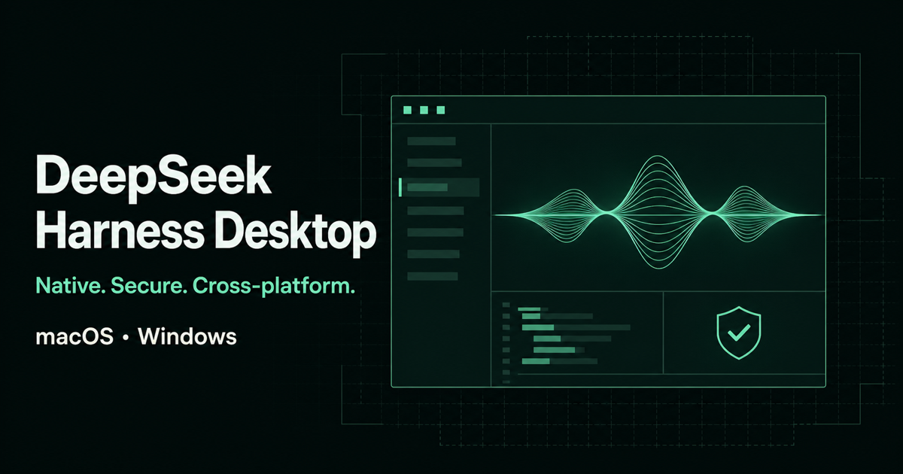

# DeepSeek Harness Desktop

将 DeepSeek Harness Web UI 封装为安全、原生、跨平台的桌面应用。


[项目官网](https://wd-china.github.io/deepseek-harness-desktop/) · [下载版本](https://github.com/WD-CHINA/deepseek-harness-desktop/releases)



## 项目简介

DeepSeek Harness Desktop 是 [deepseek-ai/deepseek-harness](https://github.com/deepseek-ai/deepseek-harness) 的 Electron 桌面宿主。Electron 主进程使用自身携带的 Node.js 运行时启动 `dsh web`，从输出中取得系统分配的回环端口，再将本地 Web UI 加载到隔离的 `BrowserWindow` 中。


## 核心能力

- 内置 [DSH Better Sidebar](https://github.com/omdsh-dev/DSH-better-sidebar) 侧边栏工作台与 [DSH Market](https://github.com/dsh-market/dsh-market) 可视化插件市场，首次启动自动安装。
- 插件自动注册：每次启动前自动批准原生构建脚本、清理不兼容包、修补 node-pty 兼容性，dshmarket 安装的新插件无需手动配置。
- 支持 macOS Apple Silicon、macOS Intel 和 Windows x64 原生构建。
- Harness 服务仅监听 `127.0.0.1` 的系统随机端口。
- 开启 `contextIsolation`、沙箱和 Web 安全，关闭渲染进程 Node.js 集成。
- 主窗口只允许 Harness 同源导航；HTTP(S) 外链交给系统浏览器。
- 单实例运行，并处理窗口重建、后台服务异常退出和渲染进程崩溃。
- 应用退出时清理完整子进程树：Unix 使用进程组信号，Windows 使用 `taskkill /T`。
- Harness 配置、会话和凭据存放在 Electron `userData/dsh`，不写入默认 `~/.dsh`。


## 架构

```text
Electron Main
  ├─ 启动前 profile 预检（构建脚本白名单、冲突包清理、node-pty 补丁）
  ├─ 创建隔离 BrowserWindow
  ├─ 启动 Electron 内置 Node.js
  │    └─ @deepseek-ai/dsh → dsh web --port 0
  ├─ 后台预装 dsh-better-sidebar + dshmarket 插件（首次启动）
  ├─ 解析 http://127.0.0.1:<port>
  └─ 关闭应用时终止 Harness 进程树
```

桌面壳不复制或修改 Harness 前端。内置插件通过 DSH 官方 plugin 机制自动安装到 `userData/dsh/profiles/web`，下次启动时由 Harness 自动加载。桌面壳内置 `pnpm` 并通过 Electron 内置 Node 调用，不依赖用户或 CI 预装 Node/pnpm。通过 dshmarket 安装的新插件也会在每次启动前自动完成原生构建脚本批准与兼容性修补，无需手动配置。升级 Harness 时，通过精确版本、锁文件、自动化测试和跨平台打包检查控制兼容性风险。

## 本地开发

环境要求：

- Node.js 22
- npm（使用仓库中的 `package-lock.json`）
- macOS 或 Windows；Linux 仅保留 electron-builder 配置，不在当前 CI 支持矩阵内

```bash
git clone git@github.com:WD-CHINA/deepseek-harness-desktop.git
cd deepseek-harness-desktop
npm ci
npm start
```

默认工作区为当前用户的 Documents 目录。可通过命令行或环境变量指定初始工作区：

```bash
npm start -- --workspace /absolute/path/to/workspace

# 或
DSH_WORKSPACE=/absolute/path/to/workspace npm start
```

Harness Web UI 首次使用时仍需添加并选中工作区，然后才能发送任务。

## 常用命令


| 命令                    | 用途                            |
| --------------------- | ----------------------------- |
| `npm start`           | 编译并启动开发版 Electron 应用          |
| `npm run typecheck`   | TypeScript 类型检查               |
| `npm test`            | 执行 Vitest 测试                  |
| `npm run verify`      | 类型检查、测试和构建                    |
| `npm run pack`        | 生成当前平台未压缩应用目录                 |
| `npm run pack:mac`    | 生成 macOS 安装产物                 |
| `npm run pack:win`    | 生成 Windows 安装产物               |
| `npm run pages:build` | 将 GitHub Pages 官网构建到 `_site/` |


由于 Harness 运行依赖体积较大，桌面打包和逐文件签名会明显慢于普通 Electron 壳。当前 `asar` 暂时关闭，待 macOS 与 Windows 都验证明确的 unpack 规则后再启用。

## GitHub 未签名测试包

没有 Apple Developer Program 或 Windows 代码签名证书时，可以进入仓库的 **Actions → Unsigned Build → Run workflow** 手动生成：

- `DeepSeek Harness Desktop-<version>-mac-arm64-unsigned.dmg` 和 `.zip`
- `DeepSeek Harness Desktop-<version>-mac-x64-unsigned.dmg` 和 `.zip`
- `DeepSeek Harness Desktop-<version>-win-x64-unsigned.exe`

工作流完成后，可以从运行详情底部的 **Artifacts** 下载，Artifact 名称包含 `unsigned` 并保留 7 天；工作流还会按照 `package.json` 中的版本号创建或更新对应的 `v<version>` GitHub Release。这些文件仅用于开发、自测和受信任测试人员验证，不会替代正式签名发布流程。

> [!WARNING]
> 未签名软件无法证明发布者身份，也不能证明下载后未被篡改。只运行来自本仓库受信任 Commit 的 Artifact，并在安装前核对工作流、Commit 和文件名。不要将未签名测试包宣传为正式安装包。

macOS 应用使用不含开发者身份的 ad-hoc 签名，Gatekeeper 仍会阻止首次打开。确认来源可信后，可在 Finder 中右键应用并选择 **打开**，或前往 **系统设置 → 隐私与安全性** 审核并允许。如果系统仍提示应用“已损坏”，确认应用确实来自本仓库后，可在安装到 Applications 后执行：

```bash
xattr -dr com.apple.quarantine "/Applications/DeepSeek Harness Desktop.app"
open "/Applications/DeepSeek Harness Desktop.app"
```

第一条命令只移除这个应用的下载隔离属性，不会让系统信任其他未知软件；第二条命令用于启动应用。本工作流仅为测试构建关闭 Hardened Runtime；正式 Release 仍强制启用 Hardened Runtime、Developer ID 签名和 Apple 公证。

Windows 会显示“未知发布者”或 Microsoft Defender SmartScreen 提示。确认来源可信后，测试人员可以选择 **更多信息 → 仍要运行**；企业安全策略可能完全禁止绕过。自签名证书不会让普通 Windows 设备自动信任该应用。

现有 `.github/workflows/release.yml` 保持为手动正式签名流程，不会被测试标签自动触发；未来取得证书后，输入已有正式版本标签即可使用。

## 升级 `@deepseek-ai/dsh`

不要直接使用范围版本。升级时执行：

```bash
npm install --save-exact @deepseek-ai/dsh@<目标版本>
npm run verify
npm run pack
```

随后至少人工验证启动探活输出、工作区选择、任务创建、设置与会话持久化、外链打开、应用退出后的进程残留，并等待三个原生平台打包任务全部通过。若 DSH 的 CLI 路径、`dsh web` 参数或 ready-line 输出变化，需要同步调整 `src/harness-runtime.ts` 与解析测试。

## 项目结构

```text
src/                      Electron 主进程、Harness 运行时、插件安装与测试
  main.ts                 应用入口与窗口管理
  harness-runtime.ts      DSH 子进程启动与生命周期
  plugin-installer.ts     插件自动安装、profile 预检与 Electron 兼容性修补
  plugin-tools.ts         内置 pnpm/node 包装，供 dsh plugin 在无系统 Node 环境下运行
  process-tree.ts         跨平台进程树清理
build/                    图标、macOS entitlements 与打包资源
site/                     GitHub Pages 静态官网
scripts/build-pages.mjs   官网构建脚本
docs/RELEASING.md         签名、公证与发版说明
.github/workflows/        CI、Release 与 Pages 工作流
AGENTS.md                 AI/自动化开发约束
```

## Better Sidebar 侧边栏

桌面版内置 [DSH Better Sidebar](https://github.com/omdsh-dev/DSH-better-sidebar) 插件，首次启动时自动安装到 DSH web profile 中，后续启动由 Harness 自动加载。侧边栏提供：

| 功能 | 说明 |
| --- | --- |
| 文件工作台 | 资源管理器 + CodeMirror 编辑器；图片 / Markdown / HTML 内联预览 |
| 内嵌浏览器 | 多开网页 tab，沙箱 iframe 隔离 |
| 终端 | xterm.js + node-pty 真实 shell |
| Git 面板 | diff + 历史、暂存 / 提交 / 还原 |
| 后台任务 | subagent 拓扑与任务管理 |
| 双工作台 | 右侧栏 + 底部面板，支持拖拽拆分 |

## DSH Market 插件市场

桌面版内置 [DSH Market](https://github.com/dsh-market/dsh-market) 可视化插件市场，打开 **设置 → Plugin Market** 即可浏览、搜索、一键安装社区 300+ 插件。

- 分类筛选、星标排序、中英双语描述
- 主题标签页：社区皮肤一键切换，无需重启
- 安装 / 更新 / 卸载全程可视化，支持日志导出
- 插件来源限制在 [awesome-dsh-plugin](https://awesome-dsh-plugin.com) 审核目录内

### 插件自动注册

通过 dshmarket 安装的插件会在下次启动时自动完成以下处理，无需手动配置：

1. **构建脚本批准**：自动批准所有原生模块的 `set this to true or false` 占位（如 node-pty、ssh2、cloudflared 等）
2. **不兼容包清理**：自动移除与 web 基础包冲突的终端 TUI 包
3. **node-pty 补丁**：修补 `conpty_console_list_agent.js`，使 `AttachConsole()` 在 `ELECTRON_RUN_AS_NODE` 环境下优雅降级

## 开发约束

修改前请阅读 [AGENTS.md](AGENTS.md)。AI 生成代码必须经过人工 Code Review 和目标平台验证，不应在未确认的情况下直接用于正式发布。

本仓库是社区桌面封装项目；DeepSeek Harness 的版权和许可遵循其上游仓库声明。
